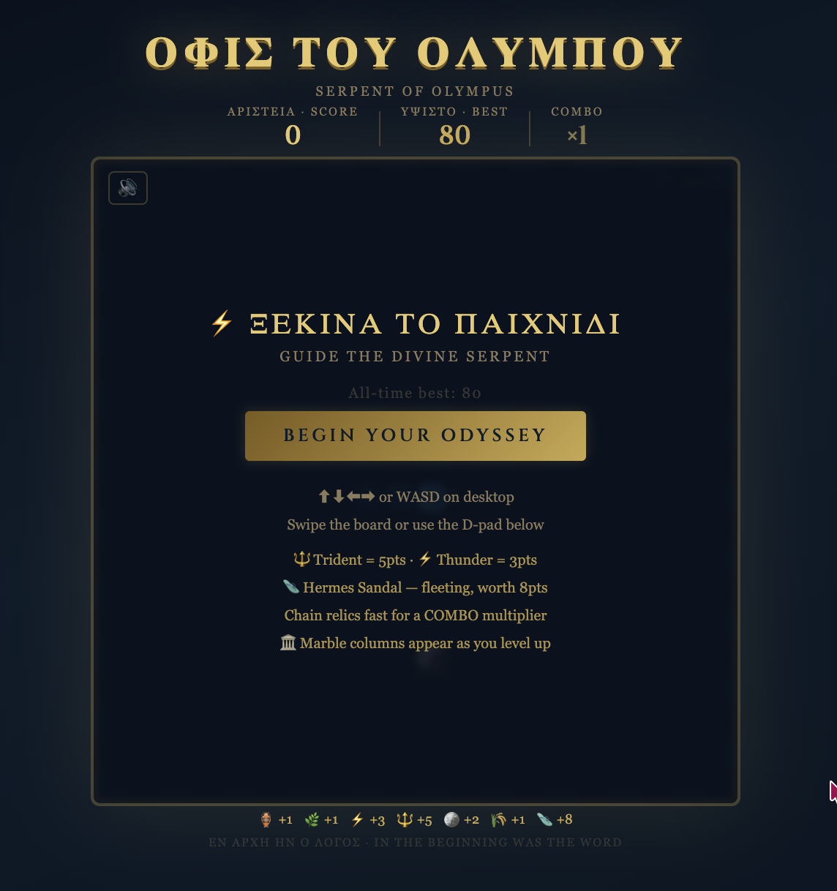
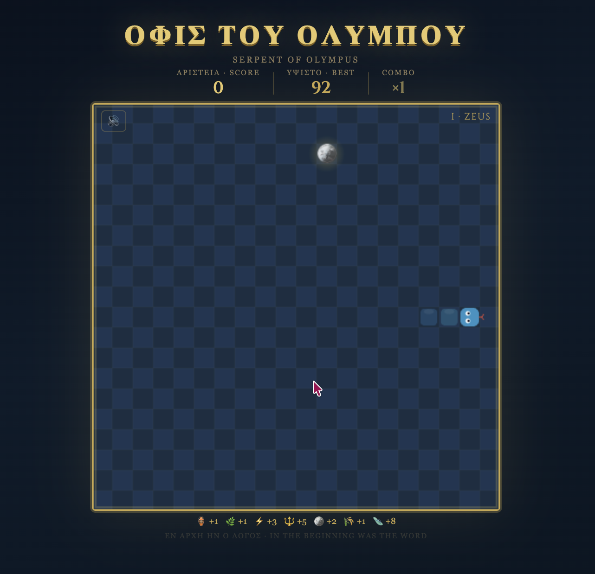
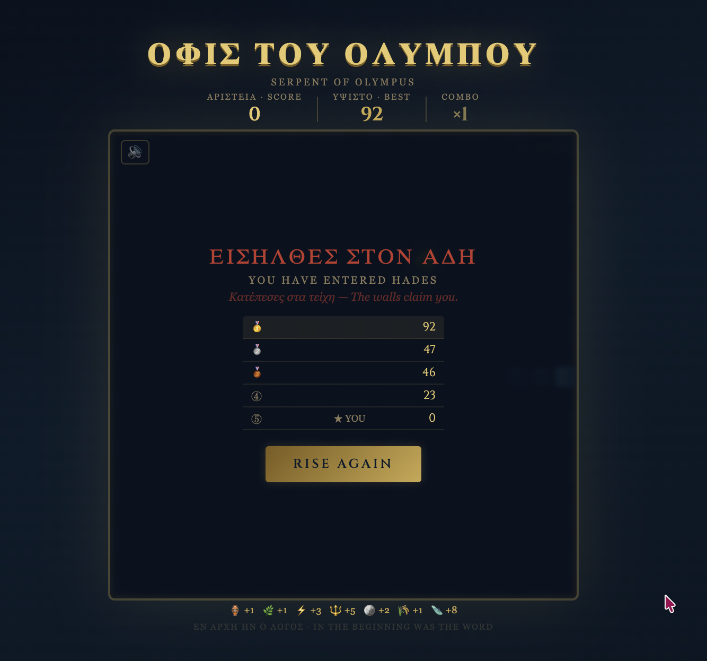

# 🐍 Όφις του Ολύμπου — Serpent of Olympus

> *A Greek-mythology themed Snake game, playable in any browser with no dependencies.*



**[▶ Play now](https://pantelistsagkas.github.io/serpent-of-olympus)**

---

## What is this?

Serpent of Olympus is a reimagining of the classic Snake game set in the marble halls of ancient Greece. You guide a divine serpent across a stone-tiled arena, collecting sacred relics — amphorae, laurel wreaths, bolts of Zeus, and the trident of Poseidon — while dodging marble columns that rise as you advance through four god-presided levels.

Everything runs in a single `index.html` file with no build step, no framework, and no external dependencies beyond a Google Font. The entire game is ~30 KB.

---

## Features

| Feature | Detail |
|---|---|
| **4 levels** | Zeus → Poseidon → Hades → Athena, each faster with more obstacles |
| **6 relics** | Weighted rarity; rarer relics score higher (🔱 Trident = 5pts) |
| **Sandal of Hermes 🩴** | Rare bonus relic that appears for 5 seconds, worth 8 pts |
| **Combo multiplier** | Chain collections quickly for ×2–×5 score |
| **Marble columns 🏛** | Obstacle cells that spawn on level-up |
| **Particle effects** | Golden burst on every collection, more dramatic for rare relics |
| **Sound effects** | Web Audio API tones: eat, level-up, die, combo, bonus |
| **Persistent leaderboard** | Top 5 session scores + all-time best saved in localStorage |
| **Mobile ready** | Swipe gestures + on-screen D-pad |
| **Keyboard** | Arrow keys or WASD · Space to pause |

---

## Screenshots

**Gameplay** — guide the serpent across the marble arena and collect relics.



**Game over** — enter Hades, check the leaderboard, and rise again.



---

## Deploy to GitHub Pages

This takes under 3 minutes.

**Step 1 — Create the repo**

Go to [github.com/new](https://github.com/new) and create a new public repository. Name it anything you like, e.g. `serpent-of-olympus`.

**Step 2 — Add the file**

Clone the repo and copy `index.html` into the root:

```bash
git clone https://github.com/PantelisTsagkas/serpent-of-olympus.git
cd serpent-of-olympus
cp /path/to/index.html .
git add index.html
git commit -m "feat: initial release of Serpent of Olympus"
git push origin main
```

**Step 3 — Enable Pages**

1. Open your repo on GitHub
2. Go to **Settings → Pages**
3. Under *Source*, select **Deploy from a branch**
4. Choose **main** branch, **/ (root)** folder
5. Click **Save**

Your game will be live at `https://pantelistsagkas.github.io/serpent-of-olympus` within about 60 seconds.

**Step 4 — Update the links in this README**

The live URL and username are already set in this file.

---

## Local development

No install needed. Just open the file in your browser:

```bash
# macOS
open index.html

# Linux
xdg-open index.html

# Windows
start index.html
```

Or serve it with any static server if you prefer:

```bash
npx serve .
# or
python3 -m http.server 8080
```

---

## Project structure

```
serpent-of-olympus/
├── index.html                # The entire game — HTML, CSS, and JS in one file
├── screenshot-start-menu.png # Start menu screenshot for README
├── screenshot-gameplay.png   # Gameplay screenshot for README / social sharing
├── screenshot-game-over.png  # Game over screenshot for README
└── README.md                 # This file
```

The game is intentionally kept as a single self-contained file. If you want to extend it significantly, consider splitting it into separate `game.js` and `styles.css` files and using a bundler like Vite.

---

## How to contribute

Contributions are welcome — bug fixes, new features, or improvements to the Greek theme.

**1. Fork and clone**

```bash
git clone https://github.com/PantelisTsagkas/serpent-of-olympus.git
cd serpent-of-olympus
```

**2. Make your changes**

Since there's no build step, just edit `index.html` and open it in your browser to test.

**3. Test across devices**

- Desktop: Chrome, Firefox, Safari, Edge
- Mobile: use your browser's DevTools device emulator, or test on a real device

**4. Open a pull request**

- Write a clear title describing what changed
- Include a short description of why the change improves the game
- If you added a new feature, update the Features table in this README

**Ideas for contributions:**

- [ ] Power-up: Hermes' helmet (temporary invincibility)
- [ ] Power-up: Circe's spell (slow time briefly)
- [ ] Animated opening scene with Greek temple silhouette
- [ ] Hard mode: portals that wrap the snake to the opposite wall
- [ ] Accessibility: add `prefers-reduced-motion` support for particles

---

## Built with

- Vanilla JavaScript (no framework)
- HTML5 Canvas for game rendering
- Web Audio API for sound effects
- CSS animations for UI
- [Cinzel](https://fonts.google.com/specimen/Cinzel) — Google Fonts (Roman-inscribed serif)
- localStorage for persistent high score

---

## Licence

MIT — do whatever you like with it. If you build something cool on top of it, a mention would be appreciated.

---

*Καλή επιτυχία — Good luck, hero.*
